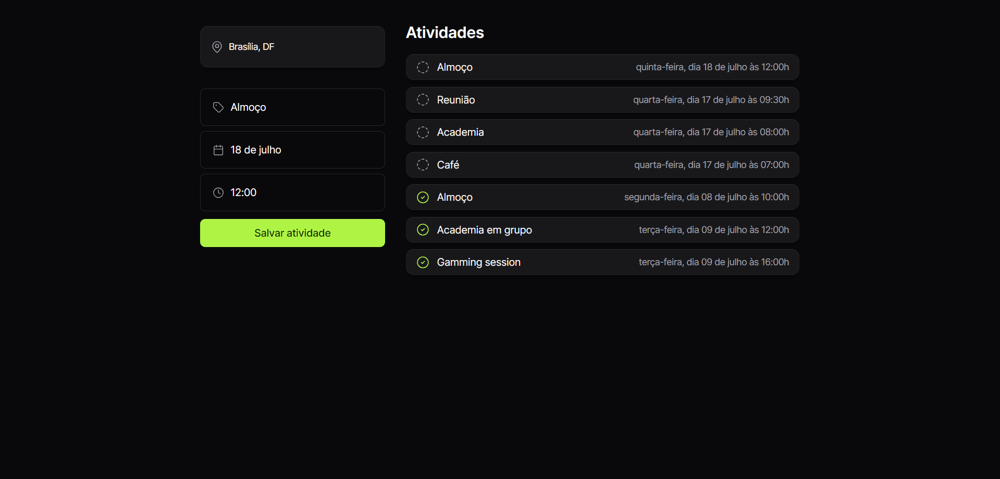

<h1 align="center"> Roteiro de Viagem </h1>

  <a href="#-tecnologias">Tecnologias</a>&nbsp;&nbsp;&nbsp;|&nbsp;&nbsp;&nbsp;
  <a href="#-projeto">Projeto</a>&nbsp;&nbsp;&nbsp;|&nbsp;&nbsp;&nbsp;

 

  

## 🚀 Tecnologias

Esse projeto foi desenvolvido com as seguintes tecnologias:

- HTML 
- CSS
- JavaScript
- Git e Github

## 💻 Projeto

Este projeto teve como objetivo principal simplificar o planejamento de viagens proporcionando uma maneira mais eficiente de organizar seu itinerário.
Ele permite a inclusão de atividades com suas respectivas datas e horários, facilitando o controle e a gestão do tempo durante a viagem.
Além disso, após a conclusão de cada atividade, há a funcionalidade integrada para marcar as tarefas como concluídas, garantindo que você mantenha o controle do que já foi realizado.
